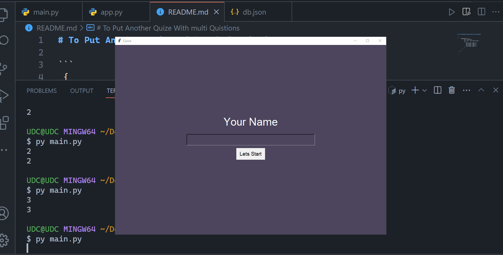

# Quiz App ✨




##### To Put Another Quiz With multi Quistions 

- Go To : **db.json**
- Put To List Another Quiz like that 👇

```
 {
      "NameOfQuiz": [{
            "Q": "Quistion",
            "A": int , The right Answer ,
            "C": [
               "the answer index 0",
               "the answer index 1",
               "the answer index 2",
               "the answer index 3"
            ]
         }
      
      ]
   }


```


